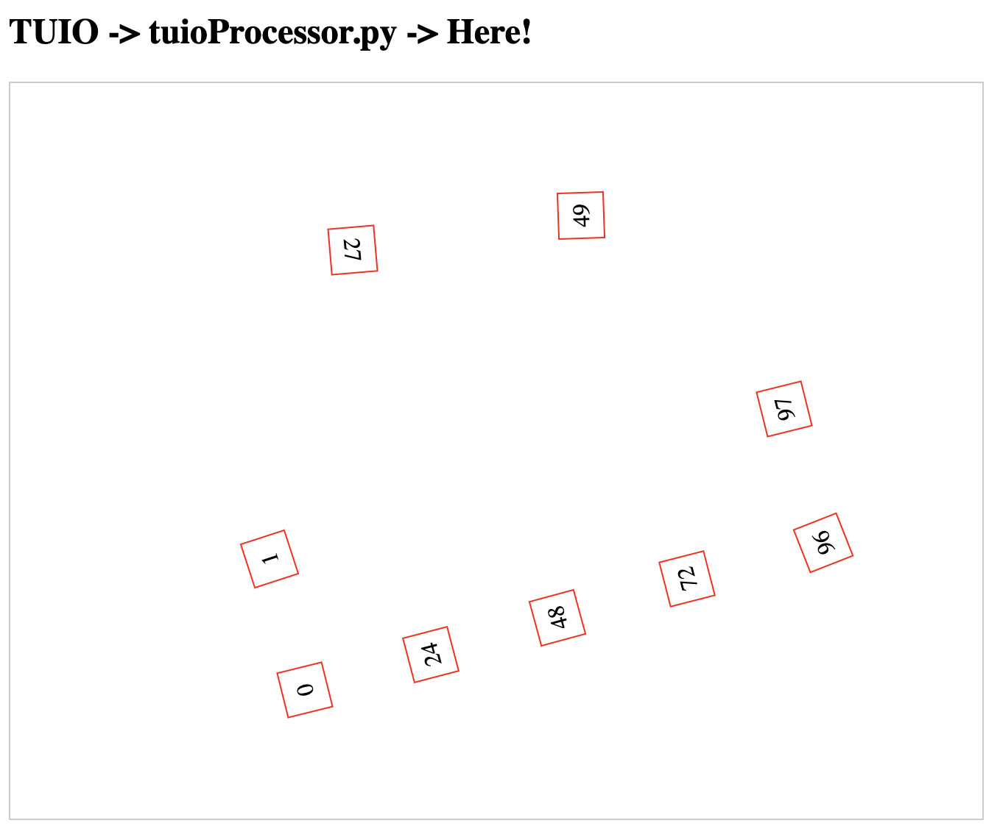

# AprilTagVision


AprilTagVision is a drop-in replacement for [reacTIVision](https://reactivision.sourceforge.net/), using the [Apriltags3](https://github.com/AprilRobotics/apriltags) library developed by [AprilRobotics](https://april.eecs.umich.edu/). The AprilTag library and its fiducial markers, are faster, smaller, and more robust. AprilTagVision uses [pupil-apriltags](https://github.com/pupil-labs/apriltags).


## Install (Easy)


Download Mac binaries from https://github.com/dantaeyoung/AprilTagVision/tags.

For Mac: Extract `apriltagvision_mac.zip`. Run `./apriltagvision --help` from the command line.


## Install (Python)


1. Download this repo.

2. Install the dependencies listed in the requirements.txt file:
   `pip install -r requirements.txt`
   

## Running AprilTagVision


Basic:

- `python apriltagvision.py`
  
Select camera:

- `python apriltagvision.py --camera 2`

Select camera and force camera dimensions:

- `python apriltagvision.py --camera 3 --width 640 --height 480`

Select camera and output verbose debug output:

- `python apriltagvision.py --camera 1 --verbose`

Press `p` to pause processing. Press `q` to quit.


## Output

Like reacTIVision, AprilTagVision follows the [TUIO Protocol 1.1](https://www.tuio.org/?specification) and sends messages out via OSC on port 3333.

Example messages might look like:
```
{"address":"/tuio/2Dobj","args":["source","apriltagvision"]}
{"address":"/tuio/2Dobj","args":["alive",100,101]}
{"address":"/tuio/2Dobj","args":["set",101,49,0.3847601115703583,0.32317110896110535,0.48030000925064087,0,0,0,0,0]}
{"address":"/tuio/2Dobj","args":["set",102,73,0.6303706765174866,0.22211359441280365,1.68340003490448,0,0,0,0,0]}
{"address":"/tuio/2Dobj","args":["fseq",78]}
```

Right now, AprilTagVision only supports fiducial markers. There is no camera calibration or touch detection.

# Helper Utilities

## tuioProcessor.py

`tuioProcessor.py` is a file that listens to TUIO messages on port 3333, processes them, and outputs 'tag appeared/moved/disappeared' signals to 1) via OSC on port 3334, and 2) via websockets on ws://localhost:8765.

Example messages might look like:
```
{"tagid": 27, "change": "appeared", "xpos": 0.5228530764579773, "ypos": 0.8543822169303894, "ang": 3.0566999912261963, "xvel": 0, "yvel": 0, "angvel": 0}
{"tagid": 27, "change": "moved", "xpos": 0.5225427150726318, "ypos": 0.8544207215309143, "ang": 3.0018999576568604, "xvel": 0, "yvel": 0, "angvel": 0.05480000004172325}
{"tagid": 27, "change": "disappeared"}
```

### To use:
1) Run AprilTagVision with `python apriltagvision.py --camera 0`
2) While the above is running, in another terminal window, also run `python tuioProcessor.py`
3) In a browser window, open `tuio_websocket_demo_3_table_simulate.html` (or the other HTML files).

You should see


## Troubleshooting

This code is currently only tested on a Mac M1. Please let me know if you try it on another OS or system!

Happy Hacking!
